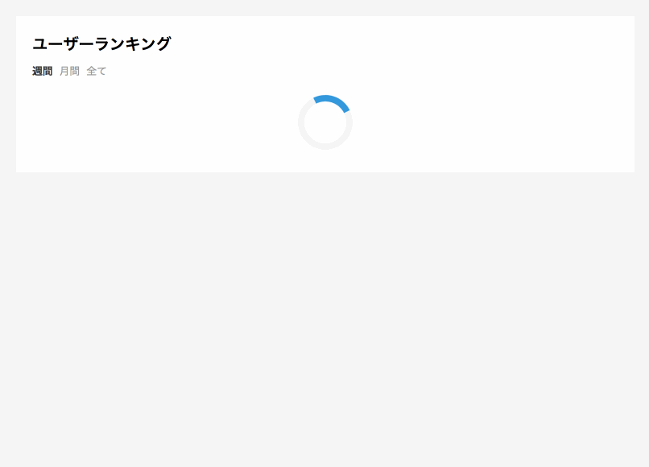

# Compare Vue.js and jQuery
同じ要件の実装をVue.jsとjQueryを利用してそれぞれ実装。

## 実装したもの
[Qiita](https://qiita.com/trend)にあるような、期間毎のユーザーランキングを表示するタブの切り替え実装。

### 要件
- ランキングデータは取得したい期間に応じてAPIから非同期で取得
- 未取得のデータがある場合、「もっと見る」ボタンを表示
- 「もっと見る」ボタンを押すとAPIをコールしてデータを取得する
- 現在表示しているランキングのデータを取得中の場合はローディングを表示
- データ読み込み中にタブを切り替えた場合、切り替えたランキングを表示しつつ読み込みを継続する
- ランキング1、2、3はそれぞれの色のトロフィー（Webフォント）を表示したい
- ユーザーネームは必ずあるわけではないため、なければユーザネームを囲むHTMLタグは描画しない
