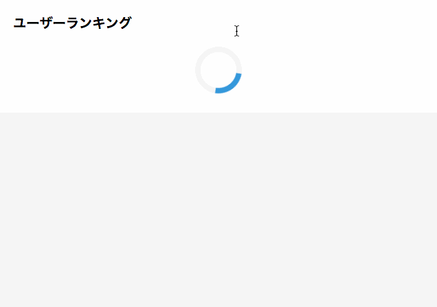

# Compare Vue.js and jQuery
同じ要件の実装をVue.jsとjQueryを利用してそれぞれ実装。

## 実装したもの
[Qiita](https://qiita.com/trend)にあるような、期間毎のユーザーランキングを表示するタブの切り替え実装。

### 要件
- ランキングデータはJSONから非同期で取得
- データ取得中はローディングを表示
- ランキング1、2、3はそれぞれの色のトロフィー（Webフォント）を表示したい
- ユーザーネームは必ずあるわけではないため、なければユーザネームを囲むHTMLタグは描画しない
